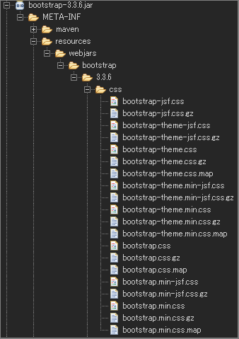
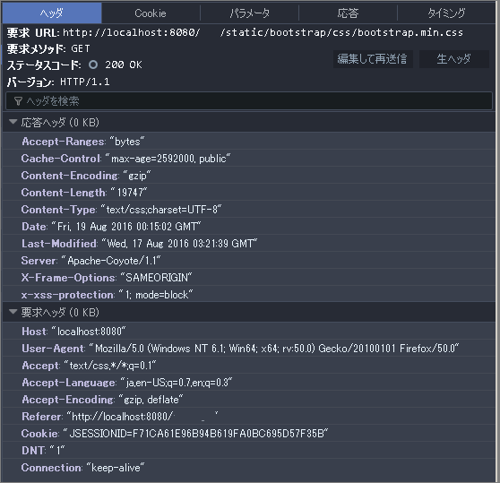

## WebJarsの利用 (XML 版)

2016.08.22 記入

SpringBoot + gradle 版は[WebJarsの利用](webjars.html "WebJarsの利用") を参照。  
WebJars 自体の説明も合わせて参照してください。

***

### 検証環境
* Spring Framework 4.3.2.RELEASE
* JSTL 1.2 (View)
* Eclipse Neon Release (4.6.0)
	* Maven(Eclipse plug-in : m2e - Maven 1.7.0.20160603-1933)

### Example WebJars Maven

Bootstrap と jQuery を WebJars として利用をする場合。  
（合わせてバージョン番号の隠蔽も同時に利用します。）

webjars-locator, bootstrap, jquery の依存関係を追加します。

* pom.xml(依存関係の追加のみ):
```XML
<dependency>
	<groupId>org.webjars</groupId>
	<artifactId>webjars-locator</artifactId>
	<version>0.32</version>
</dependency>
<dependency>
	<groupId>org.webjars</groupId>
	<artifactId>bootstrap</artifactId>
	<version>3.3.6</version>
</dependency>
<dependency>
	<groupId>org.webjars</groupId>
	<artifactId>jquery</artifactId>
	<version>2.2.4</version>
</dependency>
```

### 静的リソースのアクセス定義を行う(Spring MVC XML 定義)

* mvc-config.xml:

```XML
<?xml version="1.0" encoding="UTF-8"?>

<beans xmlns="http://www.springframework.org/schema/beans"
	xmlns:xsi="http://www.w3.org/2001/XMLSchema-instance" xmlns:context="http://www.springframework.org/schema/context"
	xmlns:mvc="http://www.springframework.org/schema/mvc" xmlns:tx="http://www.springframework.org/schema/tx"
	xmlns:util="http://www.springframework.org/schema/util"
	xsi:schemaLocation="
        http://www.springframework.org/schema/mvc http://www.springframework.org/schema/mvc/spring-mvc-4.3.xsd
        http://www.springframework.org/schema/beans http://www.springframework.org/schema/beans/spring-beans-4.3.xsd
        http://www.springframework.org/schema/context http://www.springframework.org/schema/context/spring-context-4.3.xsd
        http://www.springframework.org/schema/tx http://www.springframework.org/schema/tx/spring-tx-4.3.xsd
        http://www.springframework.org/schema/util http://www.springframework.org/schema/util/spring-util-4.3.xsd">

<!--・・・ 省略 -->

	<mvc:resources mapping="/static/**" location="/webjars/">       <!-- 1 -->
		<mvc:cache-control cache-public="true" max-age="2592000" />   <!-- 2 -->
		<mvc:resource-chain resource-cache="true">                    <!-- 3 -->
			<mvc:resolvers>
				<bean class="org.springframework.web.servlet.resource.GzipResourceResolver" /> <!-- 4 -->
			</mvc:resolvers>
		</mvc:resource-chain>
	</mvc:resources>

<!--・・・ 省略 -->

</beans>
```
既存の定義ファイルに追加します。  
1. webjars <- static としてアクセスします。
1. 全体のキャッシュを有効 max-age：有効期間(秒単位)の設定
1. リソースのキャッシュを有効
1. Gzip 化された静的リソースへのアクセス


### WebJars を テンプレートエンジン(JSTL)からの利用方法

* JSTL:


```HTML

<%@ taglib prefix="c"    uri="http://java.sun.com/jsp/jstl/core"  %>
<%@ taglib prefix="form" uri="http://www.springframework.org/tags/form" %>
<%@ page language="java" contentType="text/html; charset=UTF-8" pageEncoding="UTF-8"%>

<%-- ・・・ 省略-->

<link type="text/css" rel="stylesheet" href="<c:url value='/static/bootstrap/css/bootstrap.min.css'/>"/>
<script type="text/javascript" src="<c:url value='/static/jquery/jquery.min.js'/>"></script>
<script type="text/javascript" src="<c:url value='/static/bootstrap/js/bootstrap.min.js'/>"></script>

<%-- ・・・ 省略-->

```


### 参考

1. Gzip 化された静的リソースの例：bootstrap の webjars  


1. Gzip 化された静的リソースへのアクセスヘッダー


