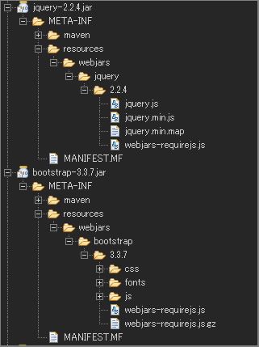

## WebJars の利用

2016.08.16 記入

***

### WebJars とは

*  JavaScript や CSS などのフロントサイドのライブラリの依存関係を、 Maven （Gradle）で管理できるようになった仕組み。
*  Maven （Gradle） なので依存関係の管理もできます。

### 検証環境

* Spring Boot 1.4.0.RELEASE
* Thymeleaf (バージョンは Spring Boot に依存)
* Eclipse Neon Release (4.6.0)
	* Gradle(Eclipse Plug-ins for Gradle 1.0.17)

### Example WebJars Gradle

Bootstrap と jQuery を WebJars として利用をする場合。

* build.gradle(依存関係の追加のみ):
```Java
compile('org.webjars:jquery:2.2.4')
compile('org.webjars:bootstrap:3.3.7')
```

### 依存関係を解決する（コマンドまたは IDE(Eclipse)）

* コマンド:

```shell
gradle dependencies
```

* IDE(Eclipse)：
	1. プロジェクトで右クリック
	1. メニューから 「Gradle」 を探す
	1. 「Refresh Gradle Project」 を選択

### 依存関係を解決後に実際にダウンロードされたファイル




指定したバージョンのファイルがダウンロードされていることが分かります。


### WebJars で管理されている jar の調べ方

1. WebJars(http://www.webjars.org/) にアクセス
1. 画面の Filter または ブラウザのページ内検索機能で対象を検索。
1. vesions からバージョンを指定（初期値は最新版です）。
1. Build Tool から Gradle, Maven 等を選択
1. Build Tool のテキストをコピーし利用する。

### WebJars を テンプレートエンジン(Thymeleaf)からの利用方法

* Thymeleaf:

```html
<link th:href="@{/webjars/bootstrap/3.3.7/css/bootstrap.min.css}" rel="stylesheet" />
<script th:src="@{/webjars/jquery/2.2.4/jquery.min.js}"></script>
<script th:src="@{/webjars/bootstrap/3.3.7/js/bootstrap.min.js}"></script>
```
※Thymeleaf で利用できる href,src ディレクティブは説明の為、省きます。

#### 補足：バージョン番号の隠蔽

各ページ（ビュー）にバージョンを指定している場合、ページ数が増えた場合、個別に修正していくのはメンテナンス性がよくありません。
共通のページを各ページでインクルードという対応もありますが、バージョンを隠蔽する方法が用意されています。


##### Webjars Locator を依存関係に追加

バージョンを隠蔽する機能の実現に Webjars Locator を利用します。

* Project Page(GitHub): https://github.com/webjars/webjars-locator
* Maven Repository: https://mvnrepository.com/artifact/org.webjars/webjars-locator

* build.gradle(Gradle の場合):
```Java
compile('org.webjars:webjars-locator:0.32')
```

##### 静的リソースのアクセス定義を行う(Spring Boot)

WebJar から静的リソースを取得するための設定を行います。

* WebConfig（該当箇所のみ）:

```Java
/**
 * 静的リソースに対する定義。
 *
 * @param registry {@link ResourceHandlerRegistry}
 */
public void addResourceHandlers(ResourceHandlerRegistry registry) {

	 // webjars の定義
	 registry.addResourceHandler("/webjars/**").addResourceLocations("classpath:/META-INF/resources/webjars/")
				 .resourceChain(false) // 自動で WebJarsResourceResolver が有効化される。
				 .addResolver(new GzipResourceResolver()); // gz ファイルへのアクセス有効化。
}
```


##### WebJars を テンプレートエンジン(Thymeleaf)からのバージョン指定なしで利用する

* Thymeleaf:

```html
<link th:href="@{/webjars/bootstrap/css/bootstrap.min.css}" rel="stylesheet" />
<script th:src="@{/webjars/jquery/jquery.min.js}"></script>
<script th:src="@{/webjars/bootstrap/js/bootstrap.min.js}"></script>
```

* 生成されるHTML:

```html
<link href="/template/webjars/bootstrap/3.3.7/css/bootstrap.min.css" rel="stylesheet" />
<script src="/template/webjars/jquery/2.2.4/jquery.min.js"></script>
<script src="/template/webjars/bootstrap/3.3.7/js/bootstrap.min.js"></script>
```

生成時はバージョンが付加されます、各 Jar のバージョン変更を行った場合、バージョンが自動的に変わります。

**ファイル構成が変わらない限り定義箇所のメンテナンスは不要です。**
